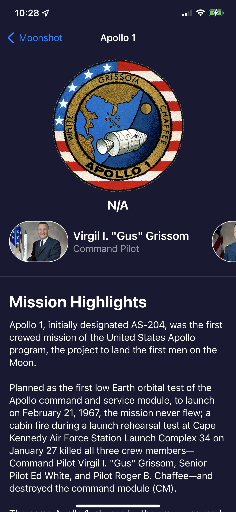

# Moonshot.swiftpm
App to learn about the Apollo project. Project 8 days 39-42 and 76 of 100 days of swiftUI.

This app pulls and parses information from a json file from nasa. I also did an accessibility audit of the program and included the notes.

   

*NOTE* This app was made completely on the iPad in swiftplaygrounds to see how that system worked. Its a little bit odd and leaves a bunch of extra files all over the place, it seems like an interesting system and does allow for ease of publication, but its very clunky and felt like you were wrestling the system while working in it. If you are looking at this code for help with 100 days of swift, I appologize for the strange layout of the files, it was the iPad playgrounds thing.
